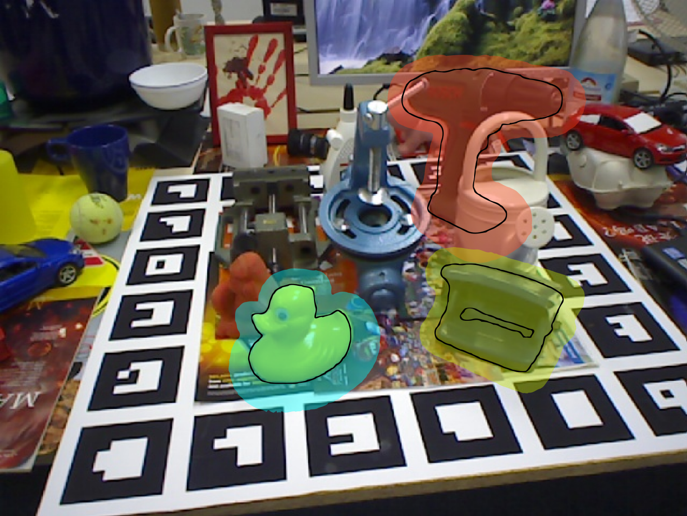
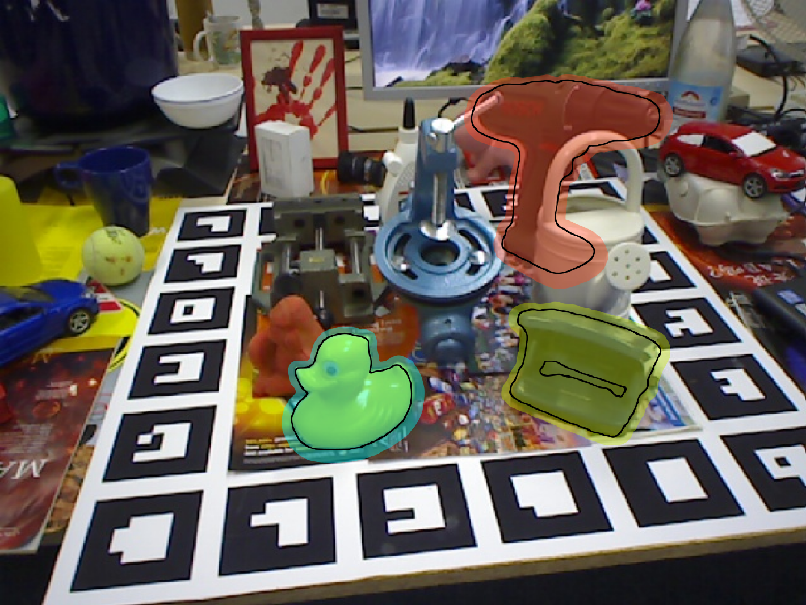
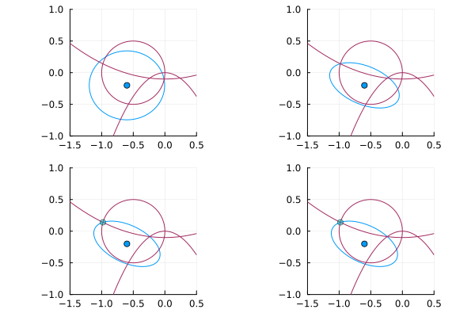

# Uncertainty Quantification for Visual Object Pose Estimation
<h3 align="center"><a href="TODO"> Paper</a> | <a href="TODO">Video</a> | <a href="TODO">Data</a></h3>


  90% confidence | 60% confidence
:-------------------------:|:-------------------------:
|

## Quick Start
First, make sure you have [Julia installed](https://julialang.org/install/). This repository was tested with v1.11.6. Then, clone the repository and follow the directions below. We assume you are in the repo folder.
1. Clone this repository
```shell
git clone https://github.com/lopenguin/PoseUncertaintySets.git
cd PoseUncertaintySets
```
2. Open the Julia REPL
```shell
julia --project
```
3. Install dependencies
```julia-repl
] # enters pkg> mode
add https://github.com/lopenguin/SimpleRotations.jl https://github.com/lopenguin/TSSOSMinimal.git https://github.com/lopenguin/P3P.jl.git
```
*You may also need to get a [MOSEK license](https://www.mosek.com/products/academic-licenses/). These are available for free to academic users.*

4. Test with 2D data
```julia-repl
# press backspace to return to the main REPL.
include("scripts/demo/demo_2d.jl")
```
It may take a while to run the first time, but try running it again (should be much faster!). This will produce a plot like the one below:

<p align="center">
  
</p>


## Quick Start
TODO:
- Data folder
- Julia environment
- Put some demo data in the repo!

### Setting up the data folder
To run experiments you will need a data folder. We show the default file structure below.
```
├── data
│   ├── lmo
│   │   ├── models_eval
│   │   ├── cal (BOP subset)
│   │   ├── test (all images)
│   │   ├── kpts3d.json
│   │   ├── detections_cal.json
│   │   ├── detections_test.json
│   ├── ycbv
│   │   ├── models_eval
│   │   ├── cal (freshly generated synthetic data)
│   │   ├── test (BOP subset)
│   │   ├── kpts3d.json
│   │   ├── detections_test.json
│   ├── cast
│   │   ├── test
│   │   ├── detections_test.json
├── PoseUncertaintySets
```
TODO: where to find all this / quick download script?


## Organization
```
├── scripts
│   ├── oneframe
├── src
│   ├── datasets
│   ├── visualization
```
- `scripts` has ready-written scripts to reproduce experiments. They may be run directly via `include("scripts/NAME.jl")` in the Julia REPL.
- `src` has functions. At the top level are the core functions for processing a single image.
- `src/datasets` contains functions for processing datasets. These rely on the core functions in `src`.

TODO

## Reproduce results
We assume you are in the home directory of this repository and you've been through the quick start step.

<details closed>

<summary><b>Keypoint Detection</b></summary>

For BOP keypoints, clone the [bop-keypoints repo](https://github.com/lopenguin/bop-keypoints) and follow the instructions in the README to setup and run keypoint detection on your dataset of choice. You'll need to run it on lmo and ycbv for the full test split. For lmo only, you need to run on the test and cal splits.

We do not release the CAST keypoint detector.

</details>


<details closed>

<summary><b>Pose Estimation</b></summary>

```shell
# run certifiable PnP
julia --project scripts/poses/pnp_pose.jl 
# run RANSAG (sample-based approach)
julia --project scripts/poses/ransag_pose.jl 
# produce the table in appendix
julia --project scripts/poses/summarize.jl 
```
The following options are available for pose estimation:
- `dataset ∈ {"lmo", "ycbv", "cast"}`: dataset to use
- `p ∈ {2,Inf}`: p-norm uncertainty set
- `α ∈ (0, 1)`: conformal confidence

(next time I will incorporate argparse)

</details>


<details closed>

<summary><b>Ellipsoids and Uncertainty Bounds</b></summary>

```shell
# S-Lemma (first order / rotation matrix)
julia --project scripts/ellipses/slem_rotm.jl 
# S-Lemma (second order / quaternion)
julia --project scripts/ellipses/slem_quat.jl 
# RANSAG (first order, can do higher order)
julia --project scripts/ellipses/ransag_bounds.jl 
# produce the table
julia --project scripts/ellipses/summarize.jl 
```
The following options are available for pose estimation:
- `dataset ∈ {"lmo", "ycbv", "cast"}`: dataset to use
- `p ∈ {2,Inf}`: p-norm uncertainty set (only `Inf` for quat)
- `α ∈ (0, 1)`: conformal confidence
- `order ∈ {1,2,...}`: relaxation order (only `2+` for quat)
- `pose ∈ {"ransag", "pnp1", "pnp2", "maxmargin"}`: source of pose estimate / center

</details>


<details closed>

<summary><b>Conformal Coverage</b></summary>

```shell
# estimate the coverage for a specific confidence / dataset
julia --project scripts/coverage.jl
```
The following options are available:
- `dataset ∈ {"lmo", "ycbv", "cast"}`: dataset to use
- `p ∈ {2,Inf}`: p-norm uncertainty set (only `Inf` for quat)
- `α ∈ (0, 1)`: conformal confidence

Note that the pose estimate choice must match the pose estimate used to generate the bounding ellipse. All experiments in the paper use `pnp2`. This script will throw errors if the slemma / pose data files are not present.

</details>


<details closed>

<summary><b>Runtime</b></summary>


```shell

```

</details>


<details closed>

<summary><b>Visualizations</b></summary>


```shell

```

</details>

## References
- RANSAG
- GRCC?
- BOP-keypoints
- LM-O
- YCB-V
- CAST

## BibTeX